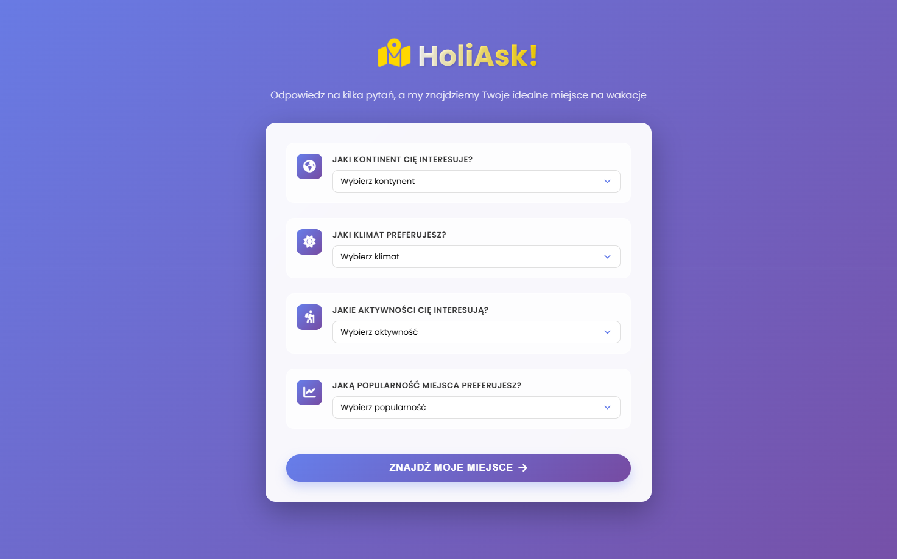
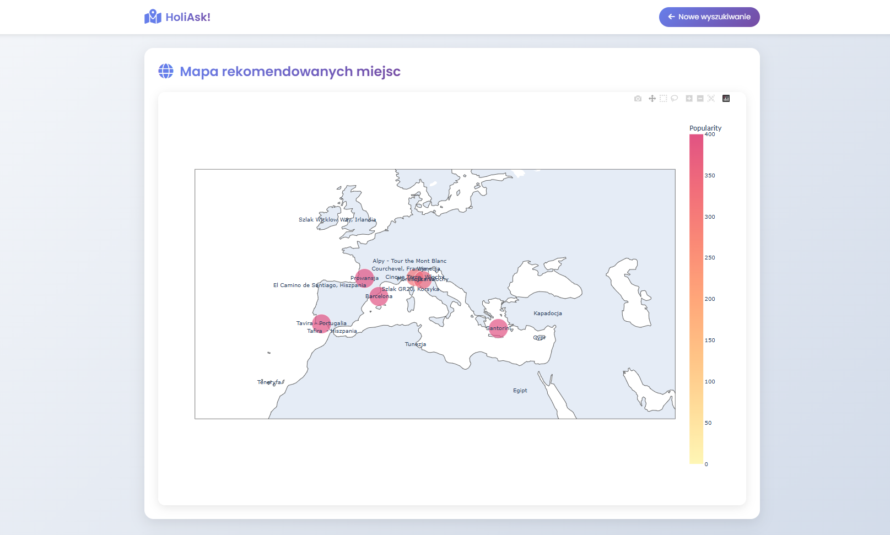
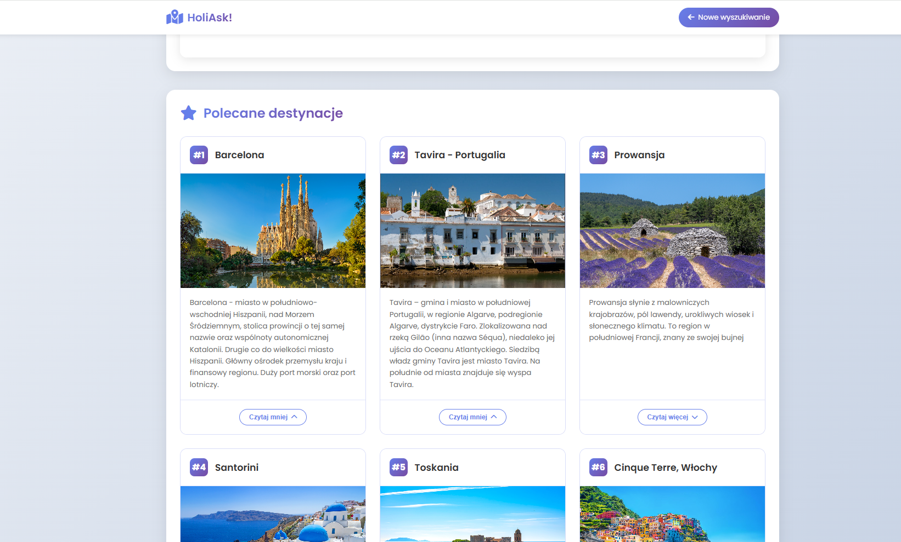

# HoliAsk! - Znajdź swoje wymarzone wakacje

## Opis

HoliAsk! to interaktywna aplikacja webowa, która pomaga użytkownikom znaleźć idealne miejsce na wakacje na podstawie ich preferencji. Użytkownik odpowiada na 4 pytania dotyczące kontynentu, klimatu, aktywności oraz popularności miejsca, a algorytm dopasowuje najlepsze destynacje z bazy ponad 50 miejsc na całym świecie. Wyniki prezentowane są na interaktywnej mapie oraz w formie kart z opisami i zdjęciami.

---

## Spis treści

- [Szybki start](#szybki-start)
- [Technologie](#technologie)
- [Moduły systemu](#moduły-systemu)
- [Dokumentacja (szczegóły)](#dokumentacja-szczegóły)


---

## Szybki start

1. Sklonuj repozytorium:
   ```bash
   git clone https://github.com/TWOJA_NAZWA_UZYTKOWNIKA/HoliAsk.git
   cd HoliAsk

2. Utwórz środowisko wirtualne i aktywuj:
bash
python -m venv venv
# Windows:
venv\Scripts\activate
# Linux/macOS:
source venv/bin/activate

3. Zainstaluj zależności:
bash
pip install -r requirements.txt

4. Uruchom aplikację:
bash
python app.py
Otwórz w przeglądarce:

http://127.0.0.1:5000/

5. Widoki aplikacji
Strona główna - formularz preferencji
https://doc/assets/screenshots/home.png

Mapa rekomendacji
https://doc/assets/screenshots/map.png

Karty destynacji
https://doc/assets/screenshots/destinations.png

## Technologie
Obszar	Technologia	Wersja	Rola w systemie
Backend	Python/Flask	3.10+ / 2.3+	Framework aplikacji webowej
Frontend	HTML/CSS/JavaScript	-	Warstwa prezentacji
Wizualizacja	Plotly	5.18+	Generowanie interaktywnych map
Dane	Pandas	2.0+	Przetwarzanie danych z Excel
Baza danych	Pliki Excel (.xlsx)	-	Przechowywanie danych o destynacjach

## Moduły systemu
Projekt został podzielony na moduły:

Strona główna (Home) – formularz zbierający preferencje użytkownika
Dokumentacja modułu: doc/architecture/home.md

Moduł mapy (Map) – generowanie interaktywnej mapy z rekomendacjami
Dokumentacja modułu: doc/architecture/map.md

Moduł rekomendacji (Recommendation) – algorytm dopasowujący destynacje
Dokumentacja modułu: doc/architecture/recommendation.md

Moduł danych (Data) – zarządzanie danymi o destynacjach
Dokumentacja modułu: doc/architecture/data.md

## Dokumentacja (szczegóły)
Dokumentacja techniczna znajduje się w katalogu doc/:

Architektura całej aplikacji: doc/architecture.md

Architektura modułów:
doc/architecture/home.md
doc/architecture/map.md
doc/architecture/recommendation.md
Konfiguracja: doc/setup.md
Prowadzenie projektu: doc/project_management.md

## Zrzuty ekranu
| Widok głównego menu | Widok mapy z destynacjami |
| :-----------------: | :----------------------------: |
|  |  |

| Widok rekomendowanych miejsc | 
| :-------------------: | 
|  | ! |

## Licencja
Projekt do użytku dydaktycznego.

